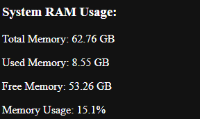

# Server Status Tracker
The name might is a bit misleading since it pertains to future plans regarding this repository. As of right now, this program is a PC resource monitor that is hosted on the local network. I find this useful when I need to check if another PC on my network is running anything without getting up; plus it has dark mode! 
It runs on a python backend using the `flask` library and html/js for the front end.

## Usage 
To set up this program, clone the repo and create either a venv or a conda environment to which you can install the requirements found in requirements.txt. 
To run this program, run `python rig_tracker.py`, you will be prompted with the name of the computer and a port to host the local web application (make sure you are not using a busy/restricted port). Once the program is running on the PC, you will then be able to access the monitor from another PC by typing `http://COMPUTER_IP:PORT` into your browser.

## Features
- Dark mode, of course.

- RAM consumption

- Top 20 processes

- Graph view of RAM and CPU

- Dark mode